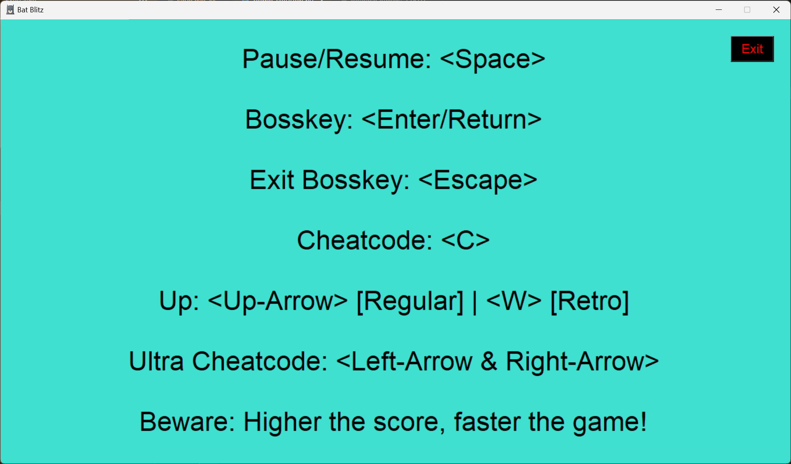

# Bat Blitz
## A modern take on the timeless 'Flappy Bird' game, with cheat codes and multiple game modes.

**Run the Game**

Run the [BatBlitz.py](https://github.com/aadityaamehrotra17/BatBlitz/blob/main/BatBlitz.py) file on your system.

**Controls**

**Additional Information**

- High scores are stored in 'files/leaderboard.txt'. These can be edited using any text editor, which will then be reflected in the game.
- Saved data is stored in 'files/save.dat' in binary format. Only one game can be saved at any given time. New saves overwrite pre-existing data.
- One can customise the gameplay by replacing the images in the 'images' folder (making sure not to change the image names).

**Contact**

If you have any questions, feel free to open an issue or reach out to me at aadityaa.mehrotra@student.manchester.ac.uk.

**License**

This project is licensed under the MIT License. For more details, see the [LICENSE](https://github.com/aadityaamehrotra17/BatBlitz/blob/main/LICENSE) file.
